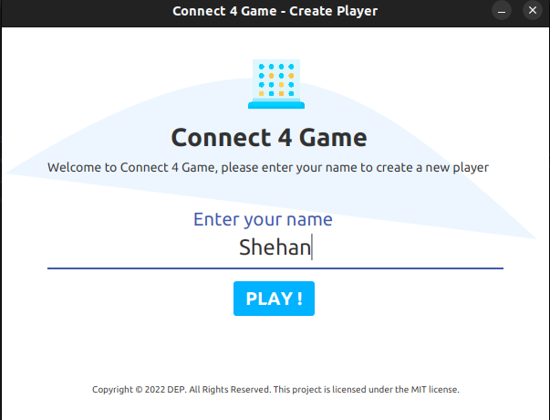
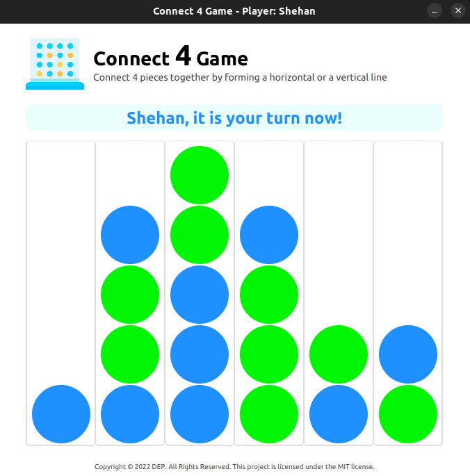
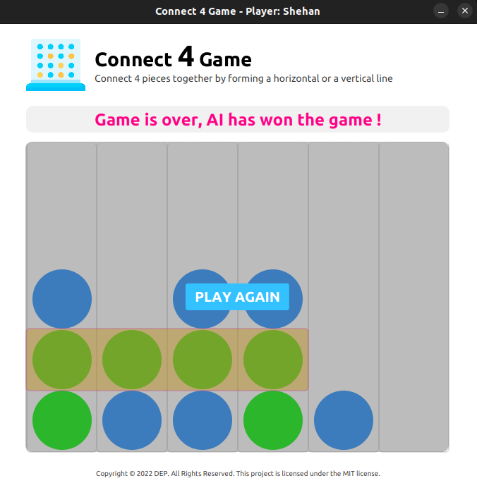
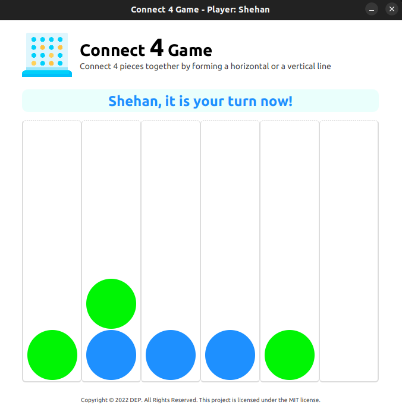
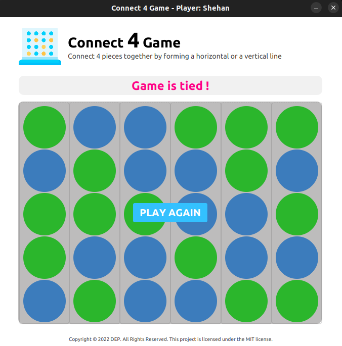

# Implementation of Monte Carlo Tree Search Algorithm for The Connect-4 Game

### Version
1.0.0

## Introduction
In this project, my primary goal was to implement an AI player class powered by the Monte Carlo Tress Search algorithm which can play for a win as well as defend a defeat to compete with a Human player.

## Demonstration
In the demonstration, AI player represent the green color and Human player represent the blue color.

### Disclaimer
The project is solely belongs to the IJSE except for the code of Monte Carlo Tree Search Algorithm implementation developed by me.

### License
Copyright © 2023 DEP. All rights reserved  
This project is licensed under the [MIT](LICENSE.txt) License.

